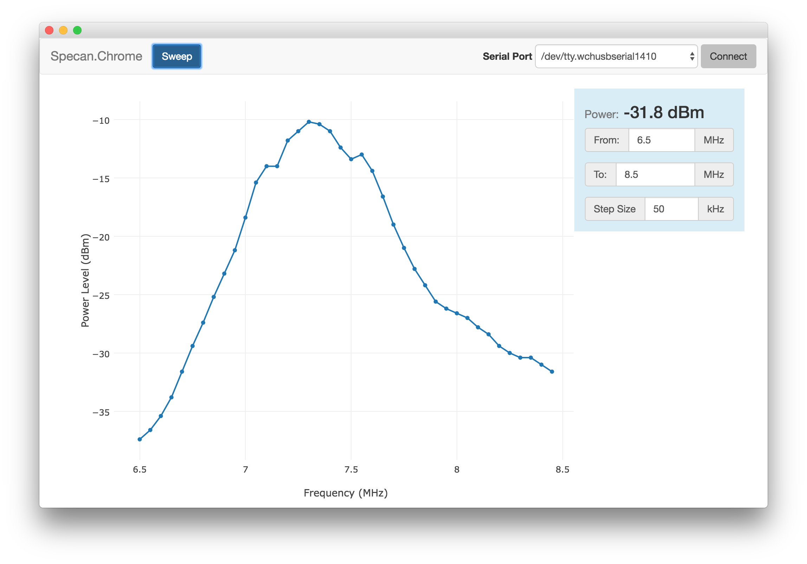

# Specan.Chrome

Specan.Chrome is a Google Chrome app that provides a UI for Ashar Farhan's
[Sweeperino](http://hfsignals.blogspot.com/p/sweeperino.html) and
[Specan](http://hfsignals.blogspot.com/p/specan-reboot-of-w7zoi.html) homebrew
RF test devices. Farhan provided a Windows application
[specan.exe](https://github.com/afarhan/specan-ui) for the original UI for
those devices, but that was not a cross-platform solution.  Specan.Chrome
is intended to be a cross-platform replacement for `specan.exe`.

These devices use Arduino microcontrollers along with Si570 RF generators and
AD8307 RF power meters. The Arduino firmware provides a serial connection that
can be used to sweep across frequencies and record the power levels.  There is
a simple line-oriented serial protocol for starting a sweep with certain
parameters and receiving the measurements back.  Specan.Chrome uses Chrome's
serial API to access the computer's serial port from within a Javascript/HTML
application that can run anywhere that Google's Chrome browser can.

## Installation

To get the code for Specan.Chrome, you can go to
<https://github.com/neilmb/specan.chrome> and click on the button marked "Clone
or Download". You can either choose to download a zip file or check out the
source code using `git` (if that's something you know how to do).  If you
downloaded a ZIP file, unzip it in some directory.

To install the Chrome application, first install the [Chrome
browser](https://www.google.com/chrome). Then, within Chrome, go to "More Tools"
and choose "Extensions". On that page in the top-right corner is a box for
"Developer Mode". After checking that box, you should be able to select a
button for "Load unpacked extension...". Then just select the directory
containing this code.

## Contributions

Specan.chrome is open-source software and benefits from contributions from the
community. Development takes place on Github at
<http://github.com/neilmb/specan>. If you experience any problems or have
suggestions for improvement, please [file issues
there](https://github.com/neilmb/specan.chrome/issues). Pull requests are
also most welcome there.

## License

Specan.chrome is Copyright 2016 Neil Martinsen-Burrell
<neilmartinsenburrell@gmail.com>.

Specan.chrome is free software: you can redistribute it and/or modify
it under the terms of the GNU General Public License as published by
the Free Software Foundation, either version 3 of the License, or
(at your option) any later version.

Specan.chrome is distributed in the hope that it will be useful,
but WITHOUT ANY WARRANTY; without even the implied warranty of
MERCHANTABILITY or FITNESS FOR A PARTICULAR PURPOSE.  See the
GNU General Public License for more details.

You should have received a copy of the GNU General Public License
along with Specan.chrome.  If not, see <http://www.gnu.org/licenses/>.
